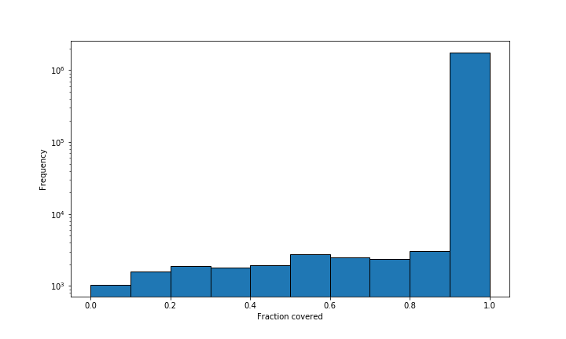
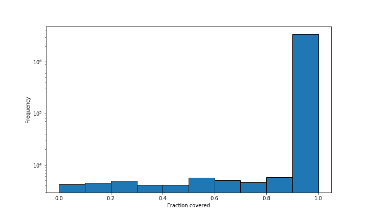

# gfa_annotate
Translate gene annotation (intervals) from a bed format to the node id space of a variation graph. The bed format is only allowed to have of four columns (see below).  

If you want to convert gff to bed file, use the [gff2bed.py script](#abcd) 

## Help message:
```text
gfa_annotate 0.1.0

Sebastian V

Overlap annotation and genome graphs

USAGE:
    gfa_annotate -g <gfa> -b <bed> -o <output>

FLAGS:
    -h, --help       Print help information
    -V, --version    Print version information

Input:
    -b <bed>        bed file
    -g <gfa>        input gfa

Additional features:
    -f, --fraction    Report fraction of how much is covered
    -l, --length      Report length in the table

Output:
    -o <output>        Output file
```


## **Example input BED format**: 
- Tab-separated
- Only four columns 

Example: 

| TAIR10 | 100 | 200 | gene |
|--------|-----|-----|------|
**OR**

| TAIR10 | 250 | 350 | AT1234 |
|--------|-----|-----|--------|

## Output 

| Col | Type        | Description  |
|-----|-------------|--------------|
| 1   | int         | Node id      |
| 2*  | String list | Type         |
| 3   | int         | Length (opt) |

*If the fraction parameter is set, the fraction value in added after the entry. If the same entry has two different fractions, entry is represented twice with different fractions. Must be here because it is specific to the annotation and not the node.

#### Example (header for understanding):
Default 

| Node id | Feature         |   
|---------|-----------------|
| 11      | AT1234          |   
| 12      | AT14213, AT4321 |   

With fraction and length:

| node id | Feature;Fraction,[]   | Length |
|---------|-----------------------|--------|
| 11      | AT1234;1              | 21     |
| 12      | AT14213;0.75,AT4321;1 | 4      |


## gff2bed.py information 

**Requirements:**
- python3
- argparse
- logging

### Pre-processing: 
```text
usage: gff2bed.py [-h] -g GFF [-a ATTRIBUTE] -o OUTPUT

optional arguments:
  -h, --help            show this help message and exit
  -g GFF, --gff GFF     Gff file
  -a ATTRIBUTE, --attribute ATTRIBUTE 
                        Extract this attribute (except of type)
  -o OUTPUT, --output OUTPUT
                        Output file

```

### Post-processing:
If you want the inverse: "Which feature/attribute is covered by which node?", you can use this python script. 
```text
usage: attribute2node.py [-h] -i INPUT -o OUTPUT

optional arguments:
  -h, --help            show this help message and exit
  -i INPUT, --input INPUT
                        gfa_annotate output file
  -o OUTPUT, --output OUTPUT
                        Output file

```

Adding intergenic information to the node -> feature data: 


## Testing
Check out ```./data/exmaple_data/```
```text
cargo test
```

### Additional information: 
**How many nodes are not fully covered?**

Annotation from one accession:


Annotation from all accessions:



## TODO
- [x] Feature --> Node list (inverse of the output right now)
- [x] Report stuff which is not covered by anything (like report all nodes no matter what)
- [ ] Update plots + the pipeline the plots were created. 
